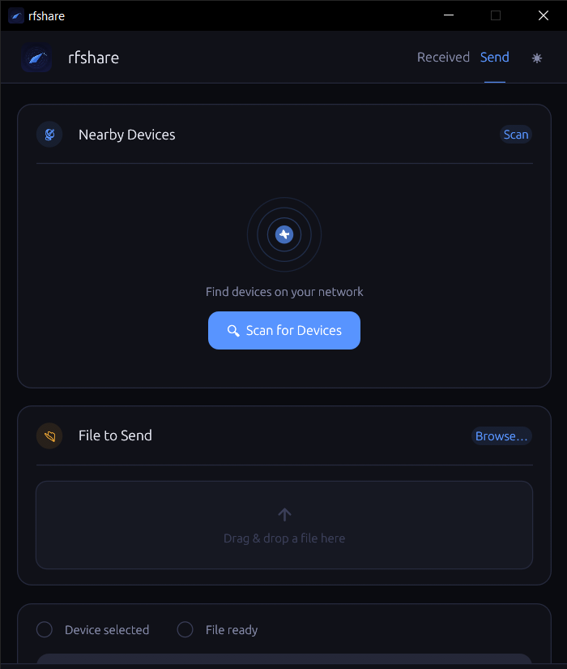
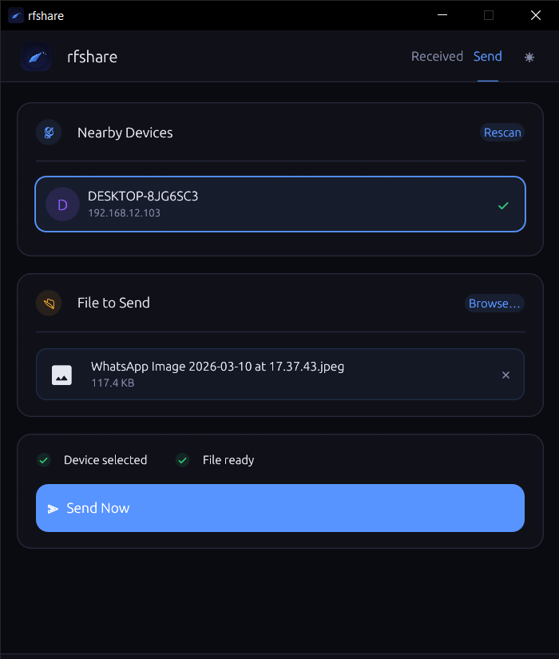
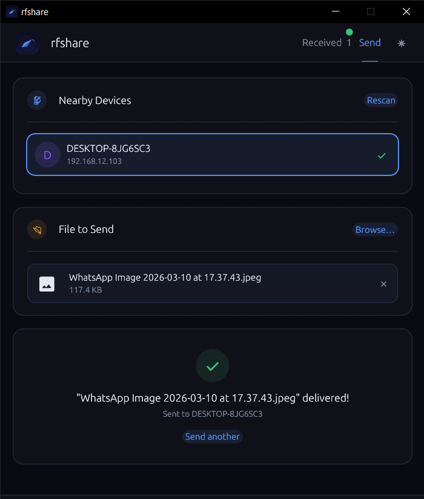
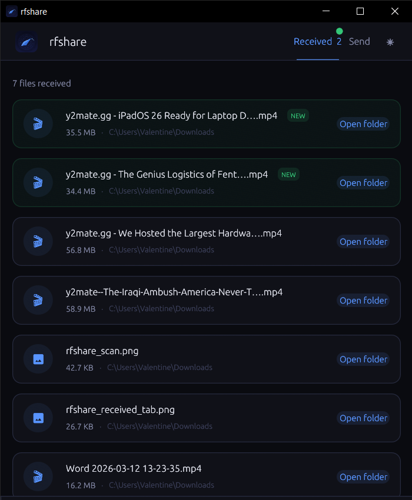
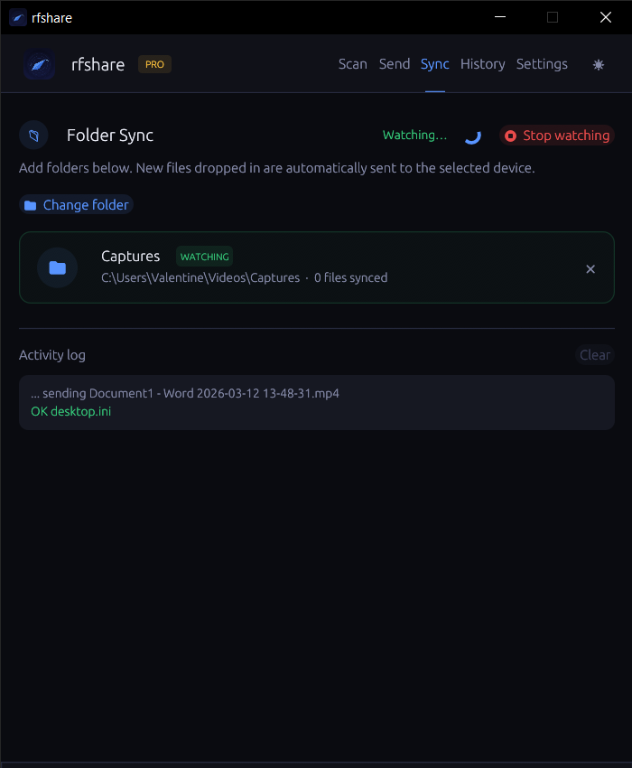

# RFSHARE
**rfshare** is a P2P encrypted file-sharing application built with Rust and the egui framework. It leverages a modern cryptographic stack, including X25519 for key exchange and AES-256-GCM for authenticated data encryption. 

## Core Architecture and Features

* Remote sharing: Support remote file sharing and folder syncing. You can share around the global.
* Folder Synchronization: The "Pro" version (validated via a simple salted hash mechanism) supports automated folder monitoring, where it periodically polls specific directories for changes and syncs them with a linked device.
* LAN Device Discovery: The application uses a dedicated UDP discovery port (44444) to find other instances of the software on the local network using a "RFSHARE_DISCOVER" broadcast message.
* Encrypted Transfers: After discovery, peers establish a secure connection on port 44445. It implements an ephemeral key exchange where a shared secret is derived to encrypt file chunks with AES-GCM.
* Modern UI: The interface uses egui with a custom color palette (supporting Light/Dark modes) and integrates Material Design icons via the [egui_material_icons](https://crates.io/crates/egui_material_icons) crate.
* Persistence: User preferences, selected peer addresses, and transfer history are stored locally in the OS's config directory (e.g., AppData on Windows) using simple JSON-free flat files and CSV formats.

**What it does in plain terms:** it lets two computers on the same Wi-Fi or LAN send files to each other directly — no internet, no cloud, no accounts, no cables.

## How it works end-to-end

When you open the app, a background thread immediately starts listening on two ports — UDP 44444 for discovery and TCP 44445 for receiving files. This means the moment the app is running, it is already ready to receive.

On the **Send tab**, you hit Scan. The app broadcasts a UDP ping to your local network. Every other device running rfshare hears that ping and replies with its hostname. Within about 2 seconds you see a list of available devices as clickable cards. You pick one, attach a file either by browsing or dragging and dropping it onto the window, then hit Send. The file is read into memory and streamed over a direct TCP connection to the selected device.

On the receiving side, the file arrives, gets saved to the Downloads folder (with automatic rename if a file by that name already exists), and a desktop notification fires — `notify-send` on Linux, `osascript` on macOS, a PowerShell toast on Windows. The **Received tab** lights up with a green dot and a NEW badge on the file card. Clicking "Open folder" opens the save location in your file manager.

**What it does not do:** it does not use the internet, it does not compress or encrypt the transfer, it does not support sending to multiple devices at once, and it does not resume interrupted transfers. It is intentionally simple — point, pick, send.

## What works

- ✅ Local network file sharing

- ✅ Remote file sharing via relay server

- ✅ Folder sync for both local and remote

- ✅ Transfer history with remote/local tracking

- ✅ System theme detection

- ✅ Cross-platform support (Windows, Mac, Linux)

- ✅ End-to-end encryption

- ✅ Resume capability for interrupted transfers

## Demonstration

<table>
  <tr>
    <td align="center"><b>1. Scanning for devices</b></td>
    <td align="center"><b>2. Sending a file</b></td>
  </tr>
  <tr>
    <td></td>
    <td></td>
  </tr>
  <tr>
    <td align="center"><b>3. Receiving a file</b></td>
    <td align="center"><b>4. Receive tab</b></td>
  </tr>
  <tr>
    <td></td>
    <td></td>
  </tr>
  <tr>
    <td align="center"><b>5. Sync a folder (Pro feature)</b></td>
  </tr>
  <tr>
    <td></td>
  </tr>
</table>

## Installation

Available in `Windows`, `Linux` and `MacOS`

### 🐧 Linux

```bash
curl -fsSL https://raw.githubusercontent.com/imrany/rfshare/main/scripts/install.sh | bash
```

Installs the `.deb` package on Debian/Ubuntu (includes desktop entry and icon).  
Falls back to a bare binary on other distros.

> **User-only install (no sudo):**
> ```bash
> PREFIX=$HOME/.local curl -fsSL https://raw.githubusercontent.com/imrany/rfshare/main/scripts/install.sh | bash
> ```

### 🍎 macOS

```bash
curl -fsSL https://raw.githubusercontent.com/imrany/rfshare/main/scripts/install.sh | bash
```

Installs the `.dmg` when available, otherwise builds a `.app` bundle and copies it to `/Applications`.  
Also installs the `rfshare` CLI to `/usr/local/bin`.

### 🪟 Windows

Paste this into **PowerShell** (no admin needed):

```powershell
irm https://raw.githubusercontent.com/imrany/rfshare/main/scripts/install.ps1 | iex
```

Installs the `.msi` when available, otherwise extracts the portable `.exe`.  
Adds rfshare to your PATH, creates a Start Menu shortcut, and registers it in Add/Remove Programs.

### Pin a specific version

**Linux / macOS**
```bash
curl -fsSL https://raw.githubusercontent.com/imrany/rfshare/main/scripts/install.sh | bash -s -- --version v0.12.0
```

**Windows**
```powershell
& ([scriptblock]::Create((irm https://raw.githubusercontent.com/imrany/rfshare/main/scripts/install.ps1))) -Version v0.12.0
```

### Uninstall

**Linux / macOS**
```bash
curl -fsSL https://raw.githubusercontent.com/imrany/rfshare/main/scripts/install.sh | bash -s -- --uninstall
```

**Windows**
```powershell
& ([scriptblock]::Create((irm https://raw.githubusercontent.com/imrany/rfshare/main/scripts/install.ps1))) -Uninstall
```

Or: **Settings → Apps → rfshare → Uninstall**

### Manual download

All binaries and installers are on the [Releases](https://github.com/imrany/rfshare/releases/latest) page.

| Platform | Installer | Portable |
|----------|-----------|---------|
| 🐧 Linux | `rfshare-vX.X.X-linux-x86_64.deb` | `rfshare-linux-vX.X.X.tar.gz` |
| 🍎 macOS | `rfshare-vX.X.X-macos.dmg` | `rfshare-macos-vX.X.X.tar.gz` |
| 🪟 Windows | `rfshare-vX.X.X-windows-x64.msi` | `rfshare-windows-vX.X.X.zip` |

Each file has a matching `.sha256` checksum.

### Pro Key License

Go to `Settings` > `License` and paste this key

```bash
29714-5B90A-54A40-254F4-B7B1C
```

Support development on [GitHub Sponsors](https://github.com/sponsors/imrany)
